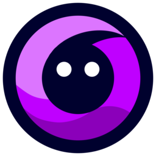

<div align="center">
  
  <h3>skybrowser</h3>
  <p>Powered By Skyrus LTDA</p>

Bem-vindo ao SkyBrowser, a inovadora porta de entrada para o universo gamer e a Rede Exclusiva do Projeto SkyrusHub, também conhecida como Web4, carinhosamente chamada de Skynet. Projetado para os aficionados por jogos e profissionais de TI que moldam o futuro digital, o SkyBrowser oferece uma interface revolucionária, aproximando os usuários de uma experiência única na nova era da web.

Com um design diferenciado, o SkyBrowser proporciona uma navegação intuitiva e envolvente, refletindo a essência dinâmica do mundo gamer. Integrando-se perfeitamente à Skynet, este navegador oferece recursos exclusivos tanto para os jogadores ávidos quanto para os desenvolvedores que contribuem para a evolução da rede no SkyrusHub.

Para os gamers, o SkyBrowser oferece uma experiência de navegação personalizada, com atualizações instantâneas sobre notícias, lançamentos e eventos importantes no mundo dos jogos. Já para os profissionais de TI, o navegador proporciona ferramentas avançadas de desenvolvimento, facilitando a criação e aprimoramento de aplicações destinadas à Skynet.

Seja explorando novos reinos virtuais ou contribuindo para a expansão da Skynet, o SkyBrowser é a escolha definitiva para aqueles que buscam uma conexão aprimorada com o futuro da tecnologia e dos jogos. Prepare-se para mergulhar em uma experiência única, onde a Skynet e a paixão pelos jogos se encontram, tudo através da inovação proporcionada pelo SkyBrowser.

</div>

# Task 22/03/24: Browser, BrowserFunctions, BrowserWith Web4(Skynet) and Web2
[ ] Browser: Crie o Browser Funcional, ele deve pegar as urls prontas e navegar na internet de fato.
- Deve ter um Regex para poder indentificar urls sem http ou https
- como adicional crie um redirecionador de links Web4

[ ] BrowserFunctions: Faça que as funções basicas de browser estejam Funcionais
- Reload Page Button
- Next Page Button
- Previus Page Button
Adicional: Home Button

# Task Atual: Sidebar
acesse o [figma do projeto](<https://www.figma.com/file/NrLRTuLsUgukNcPihae8eP/Arc-browser-interface-(Community)?type=design&node-id=2-1319&mode=design&t=6AnKmGCNJHv7b9ol-0>)

## Required Exetension
- [VSCode](https://code.visualstudio.com/)
- [ESLint](https://marketplace.visualstudio.com/items?itemName=dbaeumer.vscode-eslint)
- [Prettier](https://marketplace.visualstudio.com/items?itemName=esbenp.prettier-vscode)
- [PNPM](https://pnpm.io/pt/)
- [File Template](https://marketplace.visualstudio.com/items?itemName=RalfZhang.filetemplate)

## Project Setup

## Setup File Config
[see Config file](./Config/installGuide.md)

### Install
```bash
# PNPM
$ pnpm install

# NPM
$ npm install

# Yarn
$ yarn
```

### Development

```bash
$ pnpm dev
# or
$ yarn dev
```

### Build

```bash
# For windows
$ pnpm build:win

# For macOS
$ pnpm build:mac

# For Linux
$ pnpm build:linux
```

In Development
